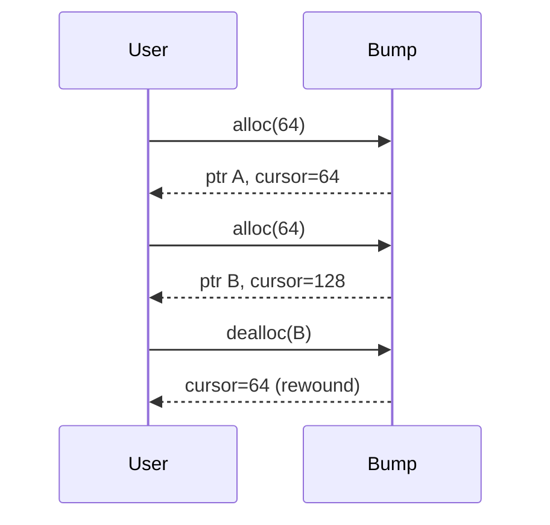
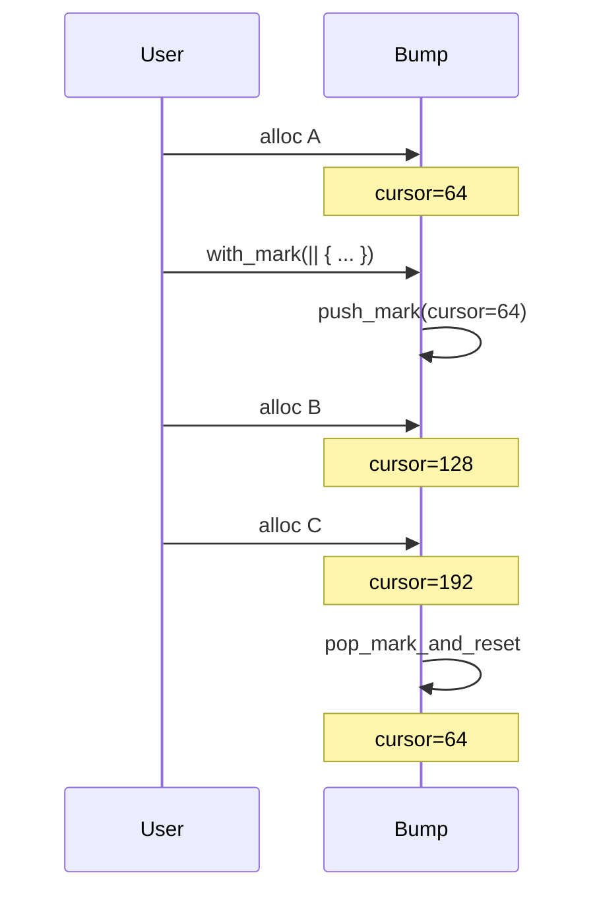
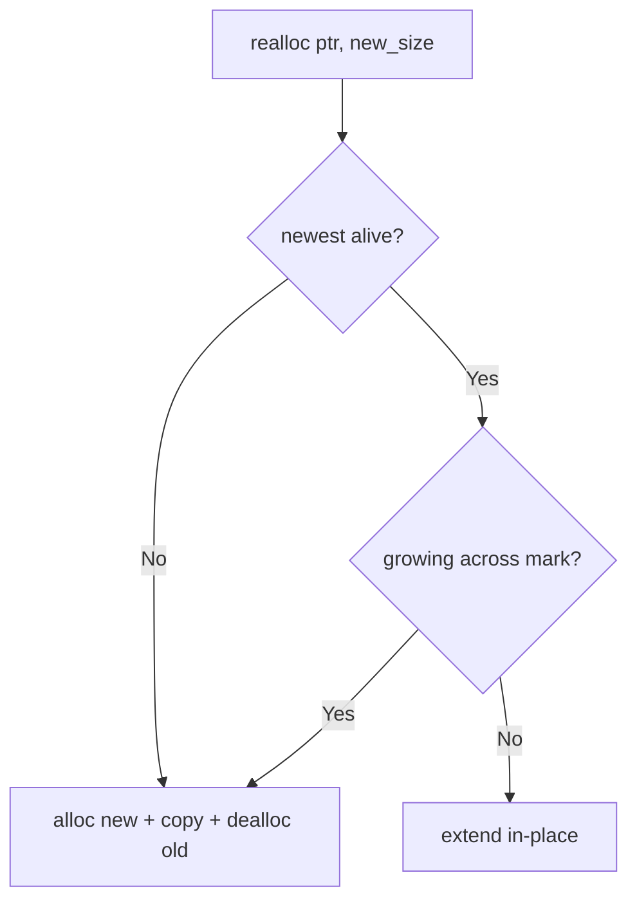

# cutback

A bump allocator that can actually give memory back.

Standard bump allocators are fast but wasteful -- once you allocate, that memory is gone until you reset the whole arena. Cutback tracks recent allocations in a small ring buffer so it can rewind the cursor when you deallocate in LIFO order. No linked lists, no per-allocation headers.

`no_std`, zero dependencies, single-threaded. Built for Solana programs, frame allocators, parsers, serializers -- anywhere you'd use a bump allocator but wish you could reclaim memory without resetting everything.

## How it works

Three mechanisms working together:

1. **Bump allocation** -- cursor advances through a contiguous arena
2. **Ring buffer rewind** -- a fixed-size ring (const generic `N`) tracks the last N allocations; LIFO deallocs rewind the cursor
3. **Scoped marks** -- `with_mark` saves/restores the cursor position via a closure, reclaiming everything allocated inside the scope

### Allocation + LIFO dealloc rewind

```
alloc A (0..64)    cursor=64   ring=[A]
alloc B (64..128)  cursor=128  ring=[A, B]
alloc C (128..192) cursor=192  ring=[A, B, C]
dealloc C          cursor=128  ring=[A, B]       <- rewinds
dealloc B          cursor=64   ring=[A]          <- rewinds again
```

### Out-of-order dealloc (no immediate rewind)

```
alloc A (0..64)    cursor=64   ring=[A]
alloc B (64..128)  cursor=128  ring=[A, B]
alloc C (128..192) cursor=192  ring=[A, B, C]
dealloc A          cursor=192  ring=[_, B, C]    <- can't rewind, B/C in the way
dealloc C          cursor=128  ring=[_, B]       <- rewinds past C
dealloc B          cursor=0    ring=[]           <- rewinds past B and A
```

### Scoped mark/reset lifecycle

```
cursor=0
alloc A            cursor=64
with_mark {
  alloc B          cursor=128
  alloc C          cursor=192
}                  cursor=64   <- scope exit rewinds to mark position
alloc D            cursor=128  <- reuses B/C's space
```

### Realloc decision path

```
realloc(ptr, old_layout, new_size):
  Is ptr the newest alive allocation?
    No  -> fallback: alloc new, copy, dealloc old
    Yes -> Is this a growth that crosses a mark boundary?
      Yes -> fallback (prevents corruption on scope exit)
      No  -> extend in-place, update cursor
```

<details>
<summary>Mermaid diagrams</summary>

#### Allocation + LIFO dealloc



#### Scoped mark/reset



#### Realloc decision



</details>

## Usage

```rust
use cutback::ScopedBump;
use core::alloc::{GlobalAlloc, Layout};

let mut arena = [0u8; 4096];
let alloc = ScopedBump::<8>::new_uninit();  // 8-slot ring buffer
unsafe { alloc.init(arena.as_mut_ptr(), arena.len()) };

let layout = Layout::from_size_align(64, 8).unwrap();
unsafe {
    let ptr = alloc.alloc(layout);
    // use it...
    alloc.dealloc(ptr, layout);  // cursor rewinds, space is free
}
```

### Scoped allocation with `with_mark`

```rust
unsafe {
    // Everything allocated inside the closure is reclaimed on return.
    // Pointers from inside the scope must not be used after with_mark returns.
    alloc.with_mark(|| {
        let a = alloc.alloc(layout);
        let b = alloc.alloc(layout);
        // use a, b...
    });
    // a and b's space is now free
    let c = alloc.alloc(layout);  // reuses the reclaimed space
}
```

Scopes nest. Inner scopes reclaim only their own allocations:

```rust
unsafe {
    let outer = alloc.alloc(layout);
    alloc.with_mark(|| {
        let inner1 = alloc.alloc(layout);
        alloc.with_mark(|| {
            let inner2 = alloc.alloc(layout);
        }); // inner2 reclaimed
        // inner1 still valid here
    }); // inner1 reclaimed
    // outer still valid
}
```

### As a global allocator

```rust
use cutback::ScopedBump;

#[global_allocator]
static ALLOC: ScopedBump<32> = ScopedBump::new_uninit();

fn main() {
    let arena: &mut [u8] = /* your memory source */;
    unsafe { ALLOC.init(arena.as_mut_ptr(), arena.len()) };
}
```

`ScopedBump::new_uninit()` is const, so it works in statics.

## Safety contracts

- **Single-threaded only.** The `Sync` impl exists for `#[global_allocator]` statics. Concurrent access is UB.
- **`with_mark` is unsafe.** Pointers to allocations made inside the closure are invalidated when the closure returns. Using them afterward is UB.
- **`init` must be called once** before any allocation, with a valid region that outlives all allocations.

## API

| Function | What it does |
|----------|-------------|
| `ScopedBump::<N>::new_uninit()` | Create an uninitialized allocator (const) |
| `init(base, cap)` | Point the allocator at your memory region |
| `alloc(layout)` | Allocate memory |
| `dealloc(ptr, layout)` | Free memory (may rewind cursor) |
| `realloc(ptr, layout, new_size)` | Resize (in-place when possible) |
| `with_mark(\|\| { ... })` | Scoped allocation -- everything inside is reclaimed on return |

## Design notes

**Ring buffer size (`N`):** Controls how many recent allocations get tracked for LIFO rewind. Anything older than N slots is "forgotten" -- still valid memory, but dealloc can't rewind for it. Pick N based on your workload.

**Mark depth:** Unlimited nesting (each scope uses one pointer on the call stack).

**Realloc safety:** When a mark scope is active, in-place growth of pre-scope allocations is blocked (falls back to alloc+copy+dealloc). This prevents cursor rewind on scope exit from corrupting grown allocations.

**ZSTs:** Return a dangling aligned pointer. Don't touch the arena or ring buffer.

**Out-of-arena pointers:** Silently ignored on dealloc.

## Limitations

- Not a general-purpose allocator. Random or long-lived allocation patterns won't benefit from the ring buffer.
- Single-threaded only. No atomic operations, no locking.
- Mark depth is unlimited but each level uses stack space (one pointer per level).
- Ring buffer is fixed-size. Old allocations fall out and lose rewind capability.

## Testing

~55 unit tests covering the allocator and ring buffer, plus property-based tests (proptest) that throw random sequences of alloc/dealloc/realloc/enter-scope/exit-scope at both the real allocator and a reference model. Checked for overlapping allocations, out-of-bounds, data corruption, alignment errors.

```
cargo test
cargo clippy --all-targets -- -D warnings
MIRIFLAGS="-Zmiri-strict-provenance" cargo +nightly miri test --lib
```

## License

MIT
